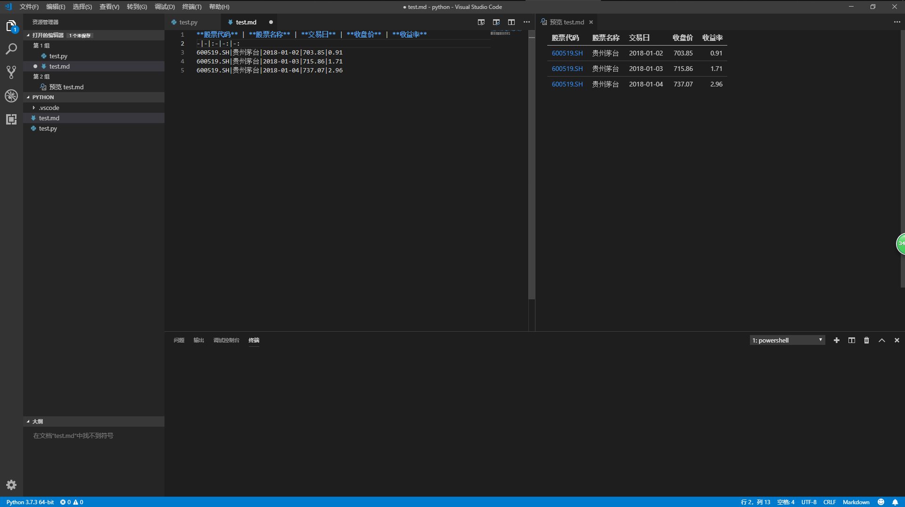

## 关于这个网页怎么用
首先这是一篇会每天更新的说明文档，第一次写长文档，遇到不清楚的地方还请大家指出  
在这个说明文档中蓝色字体的部分是可以点击下载的链接（目前有Python、VSCode、Win版Anaconda百度云，Mac版Anaconda百度云）。
在这个网址里一共有两个有用的文件夹
> TODO中存放了从第一天到更新日期的解压出来的作业，方便同学们下载  

> TOOL中存放了有用的工具（目前有Win用一键启动Jupyter、Win版滚动截屏），会不断更新，大家有什么好用的工具可以告诉我

再往下看一点有目录，可以在目录中找一下是否有自己遇到的问题，如果没有或者看了也解决不了的话，在群里艾特各位大佬就好

## 写在前面
> 自用环境是官网版[**Python3.7**](www.python.org)+[**VSCode**](https://code.visualstudio.com/)，系统是win10  

没有用老师推荐的Anaconda，不管是Anaconda还是Python+VSCode的组合，只要能正常使用都是可以的，不要拘泥于形式，毕竟条条大道通罗马。    

    

~~个人认为Anaconda太过于笨重，启动速度慢+只是用来启动jupyter的工具~~  

----  

## 目录
+ **常见问题**
	+ 课程/作业在哪里
	+ Anaconda下载太慢了怎么办
	+ 官方版python怎么安装jupyter
	+ 作业打不开怎么办
	+ jupyter中找不到作业怎么办
	+ 官方版的Python安装jupyter之后怎么用
	+ 在命令行/终端/Anaconda中运行jupyter之后没有反应怎么办
	+ 在Jupyter在显示IN[*]怎么办
+ **DAY1常见问题**
	+ 第四题运行报错
	+ 第四题无法左对齐

---
## 接下来开始正式总结大家遇到的常见问题
---
+ **Q: 课程/作业在哪里？**
+ A: 登陆[官网](www.enaca.cn)之后，在*我的活动*里可以看到每天的课程回放和作业
----
+ **Q: Anaconda下载太慢了怎么办？**
+ A: Win版点[这里](https://pan.baidu.com/s/1fAi2lc1EzGEtMdSzhMOp1w)就可以下载啦(提取码：NX49)  
Mac版点[这里](https://pan.baidu.com/s/1HAxGfLNicT3Bu3swfBkzxQ)下载(提取码：7te3)  
----
+ **Q: 官方版python怎么安装jupyter？**
+ A: Win版打开*命令行*（先按win+r键，再输入cmd），输入pip install jupyter就可以啦（**必须先安装python**）
Mac版打开*应用程序*里的*终端*，输入pip install jupyter就好
----
+ **Q: 作业打不开怎么办？**
+ A: 作业是ipynb格式，必须要用jupyter打开才行，进入到jupyter界面之后找到放ipynb的目录之后双击打开就可以看到作业啦。  
  *官网下载的rar格式需要先解压，解压的方法请同学们自行百度*
----
+ **Q: jupyter中找不到作业怎么办**
+ A: RAR格式是找不到的，必须要解压出来之后才行
----
+ **Q: 官方版的Python安装jupyter之后怎么用？**
+ A: 在*命令行*(Mac在*终端*)中执行jupyter notebook即可。当然装了Anaconda的同学们也可以在Anaconda的命令行中执行jupyter notebook，可以快速打开，不用等待主界面加载
----
+ **Q: 在命令行/终端/Anaconda中运行jupyter之后没有反应怎么办？**
+ A: 运行之后会弹出来一个黑窗口，稍等一会之后，把最下面一行http开头的网址粘贴到任意浏览器中就可以使用了（**用IE白屏的换个浏览器**）

----
+ **Q: 在Jupyter中显示IN[*]怎么办**
+ A: 显示IN[*]是因为在这行之前有代码错误，因为排查起来比较费劲，建议重新解压一遍作业  
~~这里再次安利VSCode，可以把找错的时间用来学习~~

----
## DAY1遇到的常见问题
----
+ **Q: 第四题运行报错**
+ A:在窗口的上边把代码（code）改成标记（markdown）之后再次运行就好
----
+ **Q: 第四题无法左对齐**
+ A: 这是解释器的问题，不用太过纠结，理解三种对齐的用法就好